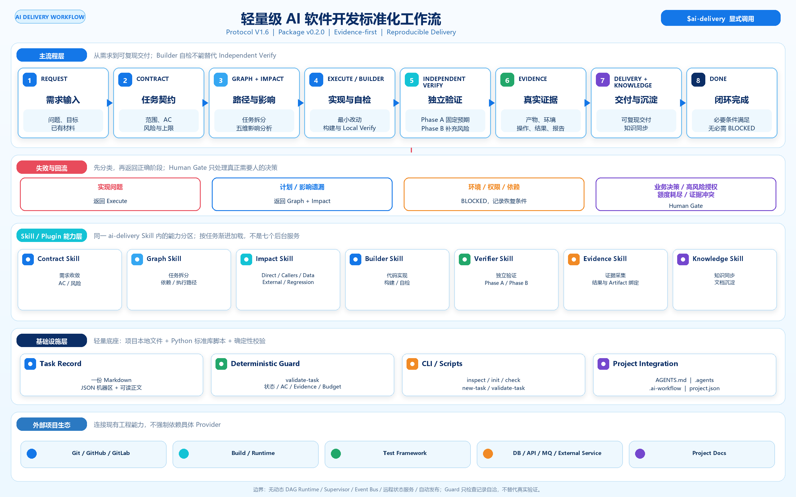

# AI Delivery Workflow

[](https://github.com/longzhang2026-sudo/ai-delivery-workflow/actions/workflows/ci.yml)
[](LICENSE)
[](skills/ai-delivery/references/protocol.md)
[](CHANGELOG.md)
[English](README.en.md)

**把需求交给 Codex，通过任务契约、独立验证和真实 Evidence，形成可复现的软件交付。**

AI Delivery Workflow 是《轻量级 AI 软件开发标准化工作流 V1.6》的开源 Skill 实现。它把 Agent 开发从“完成了一段代码”推进到“范围明确、证据有效、可以复现和继续维护的交付”。

项目采用 Python 标准库和项目本地文件，不要求固定 MCP、Git、Docker 或付费 API。当前包版本为 **v0.2.0**，流程协议保持 **V1.6**。



主流程以 Contract 固定目标与验收，以 Graph + Impact 约束执行路径和影响面；Builder 负责实现与自检，独立 Verifier 分 Phase A / Phase B 验收；结论只接受绑定当前产物的真实 Evidence。Task Record 和 Deterministic Guard 横切整个流程，但不替代业务判断或实际验证。

## 解决什么问题

普通 Agent 开发容易出现四类缺口：需求边界在执行中漂移、自检被当作最终验收、测试结论没有对应产物与原始证据、交付后缺少复现和知识同步。本工作流用一条轻量主链约束这些问题：

- **Contract-first**：先固定目标、范围、兼容边界、AC、风险和上限。
- **Impact-aware**：检查 Direct / Callers / Data / External / Regression，不只修改表面入口。
- **Independent Verify**：Builder 不拥有标准路径最终 PASS 权限；Verifier 先固定预期，再读取实现。
- **Evidence-first**：PASS 必须对应实际产物、环境、输入、操作、结果和报告位置。
- **Bounded Repair**：修复、Replan 和有效执行时间均有上限，必要时进入 Human Gate。
- **Reproducible Delivery**：交付包含 Artifact、Reproduce、Acceptance 和 Knowledge Sync。

适合可复现 Bug、普通功能的纵向切片和必要跨模块改动。首版面向开发与本地/测试环境交付，不包含生产运维。

## 核心流程

```text
Request
  -> Contract
  -> Graph + Impact
  -> Execute / Builder Self Check
  -> Independent Verify
  -> Evidence
  -> Delivery + Knowledge Sync
  -> DONE
```

Verify 未通过时先分类，再返回正确阶段：

| 问题类型 | 处理方式 |
| --- | --- |
| 实现问题 | 返回 Execute，额度内做最小修复并重新 Verify |
| 计划或影响遗漏 | 补查 Impact，必要时回到 Graph 并记录 Replan |
| 环境、权限或依赖不足 | 标记 BLOCKED，记录恢复条件和剩余额度 |
| 业务决策、高风险授权、额度耗尽或 Evidence 冲突 | 进入 Human Gate，只询问必要决策 |

同一根因最多自动修复 2 次，实质 Replan 最多 1 次；任务总修复数和有效执行时间另有限额。恢复、换模型或换上下文都不会清零累计值。

## 核心机制

### 一份 Task Record

每个任务只维护 `.ai-workflow/tasks/<TASK-ID>.md`：

- JSON 机器区保存状态、风险、额度、AC、Artifact 和 Evidence 引用。
- Markdown 正文保存 Contract、Graph、Impact、判断依据、交付与知识同步说明。
- AC 将 `type`、`applicability` 和 `verdict` 分开记录，避免把“不适用”与“未验证”混为一谈。

详细字段与 Required N/A 规则见 [Task Record schema v1](skills/ai-delivery/references/task-record-schema.md)。

### 独立验证

- **Phase A**：Verifier 只读取 Contract / AC / Impact，先固定黑盒场景、输入、预期和断言。
- **Phase B**：再读取 Diff、实现与 Builder 自检，补充事务、缓存、并发、异常等实现特有风险。
- Builder 自检不能自动升级为 Independent PASS。没有独立上下文时必须保留 `NOT_VERIFIED` 或 `BLOCKED`。

只有同时满足 LOW 风险、不修改可执行逻辑/数据/配置/权限/API、不涉及金额/状态/跨模块且 Diff 可直接审查时，才能使用 Fast Verify。

### Deterministic Guard

`validate-task` 只读检查 Task Record 的 schema、状态组合、额度和 Evidence 引用：

```bash
python .agents/skills/ai-delivery/scripts/workflow.py validate-task --project . --id TASK-001
```

合法 DRAFT 缺口产生 WARN 并返回 0；结构矛盾或 DONE 门槛不满足产生 ERROR 并返回 2。Guard 成功只代表记录自洽，不代表业务行为已经正确。

## Skill / Plugin 能力

下列名称是同一个 `ai-delivery` Skill 内的能力分区，不是七个独立后台服务：

| 能力 | 作用 |
| --- | --- |
| Contract Skill | 收敛目标、范围、AC、风险、上限和 Human Gate 条件 |
| Graph Skill | 将任务拆成“动作 -> 输出 -> 检查”，表达必要依赖与执行路径 |
| Impact Skill | 检查 Direct / Callers / Data / External / Regression |
| Builder Skill | 最小代码实现、构建、Local Verify 和交接材料 |
| Verifier Skill | 独立上下文验收，执行 Phase A / Phase B |
| Evidence Skill | 记录实际证据并绑定 AC 与当前 Artifact；当前不提供自动命令捕获服务 |
| Knowledge Skill | 把已验证、长期有效的事实同步到现有项目文档 |

仓库同时提供根目录 [`plugin.json`](plugin.json) 和 [`.codex-plugin/plugin.json`](.codex-plugin/plugin.json)。推荐方式仍是把 [`skills/ai-delivery`](skills/ai-delivery) 安装到目标项目；插件清单负责分发与兼容，不会自动获得外部工具权限。

## 快速开始

### 方式一：交给 Codex

把下面内容交给 Codex，并明确目标业务项目的位置：

```text
请把 https://github.com/longzhang2026-sudo/ai-delivery-workflow
中的 AI Delivery Skill 安装到当前项目。

先读取仓库 START.md 和初始化指南，执行 inspect -> init -> check；
保留当前项目的 AGENTS.md 和已有规则，不修改全局 Codex 配置。
识别并实际验证项目必要的 build/test/run 入口，输出初始化报告。
尚未执行的检查保持 NOT_VERIFIED；check 成功只能报告 CONFIGURED。
```

完整可复制指令见 [START.md](START.md)。需要已登录可用的 Codex、可写目标项目以及 Python 3.10+。首次安装只准备工作流，不会自动修改业务代码。

### 方式二：手动初始化

```bash
git clone https://github.com/longzhang2026-sudo/ai-delivery-workflow.git
cd ai-delivery-workflow
python skills/ai-delivery/scripts/workflow.py inspect --project "/path/to/project"
python skills/ai-delivery/scripts/workflow.py init --project "/path/to/project"
python skills/ai-delivery/scripts/workflow.py check --project "/path/to/project"
```

Windows 可以使用 `python` 或 `py -3`，macOS/Linux 按安装情况使用 `python3`。目标项目无需 GitHub 账号，也不要求 Git；也可以下载 ZIP 后让 Codex 读取本地目录。

初始化会在目标项目中安装：

```text
your-project/
├── AGENTS.md
├── .agents/skills/ai-delivery/
└── .ai-workflow/
    ├── project.json
    ├── install.json
    └── tasks/
```

`check` 成功只表示静态安装达到 `CONFIGURED`；项目必要运行入口实际通过后，才能报告限定范围的 `READY`。安装、升级、卸载和冲突处理见 [初始化指南](skills/ai-delivery/references/initialization.md)。

## 安装后使用

在目标项目中显式调用：

```text
$ai-delivery
修复订单列表切换筛选后页码没有重置的问题。
范围：只修改筛选与分页联动，保持接口和金额计算不变。
验收：筛选变化后回到第一页；清空筛选恢复默认；普通翻页保持正确。
```

Builder 完成后，在新的 Codex 任务中执行独立验收：

```text
$ai-delivery
独立验收 .ai-workflow/tasks/TASK-001.md。
Phase A 先只读 Contract、AC、Impact，固定场景与预期；
Phase B 再读取实现 Diff 和交接材料，实际运行必要验证。
不要修改业务代码，不把 Builder 自检当成最终 PASS。
```

完整的新任务、Verifier、恢复和交付示例见 [使用手册](docs/usage.md)。

## 文档导航

| 文档 | 用途 |
| --- | --- |
| [START.md](START.md) | 给安装者和 Codex 的统一入口 |
| [SKILL.md](skills/ai-delivery/SKILL.md) | Skill 路由、Builder / Verifier 职责与全程约束 |
| [V1.6 协议](skills/ai-delivery/references/protocol.md) | 主链、独立验证、Evidence、Loop、交付与 DONE 规则 |
| [初始化指南](skills/ai-delivery/references/initialization.md) | inspect / init / check、项目基线、升级与故障恢复 |
| [Task Record schema](skills/ai-delivery/references/task-record-schema.md) | 机器区、AC 合法组合、Evidence 与 Guard 错误规则 |
| [使用手册](docs/usage.md) | 从需求到验收、恢复和交付的完整步骤 |
| [任务模板](skills/ai-delivery/assets/task.md) | 一份记录承载契约、证据、交付与知识同步 |
| [示例](examples/bug-fix.md) | 虚构 Bug，展示真实填写方式，不伪造通过结果 |
| [验证方法](docs/testing.md) | 脚本回归、Agent 行为场景和真实试点边界 |
| [设计来源](docs/design.md) | V1.6 原文映射、专业 Skill 参考和简化原则 |

## 边界与限制

- 当前版本覆盖开发与本地/测试环境交付，不包含生产发布和运维。
- Guard 不能证明业务语义正确、Evidence 未伪造、Verifier 绝对独立或历史未被修改。
- 当前没有自动 Evidence Capture、完整 dirty-worktree Artifact 快照或防篡改账本。
- 不包含动态 DAG Runtime、Agent Supervisor、Event Bus、远程状态服务、复杂 Memory 或自动发布系统。
- MCP、CodeGraph、数据库工具、浏览器和 CI 都是可替换 Provider；缺少某个插件不等于流程必须停止。
- 项目仍标记 `NOT_YET_PILOTED`：工程检查已经通过，真实业务交付稳定性仍需用 Bug、功能切片和跨模块任务验证。

## 测试与贡献

```bash
python -m unittest discover -s tests -v
```

测试覆盖安装器、项目配置、Task Guard、有限项目扫描与文档结构，并在 Windows、Linux、macOS 的 Python 3.10 / 3.13 环境运行。测试通过不等于真实客户项目已经完成 V1.6 试点。

欢迎提交问题和最小修复。开始前请阅读 [贡献指南](CONTRIBUTING.md)、[变更记录](CHANGELOG.md) 与 [MIT 许可证](LICENSE)。本仓库只参考成熟 Skill 的组织方式，不复制受其他许可约束的实现。
