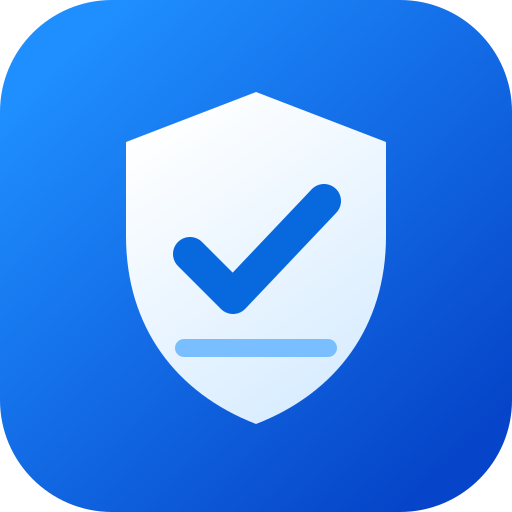
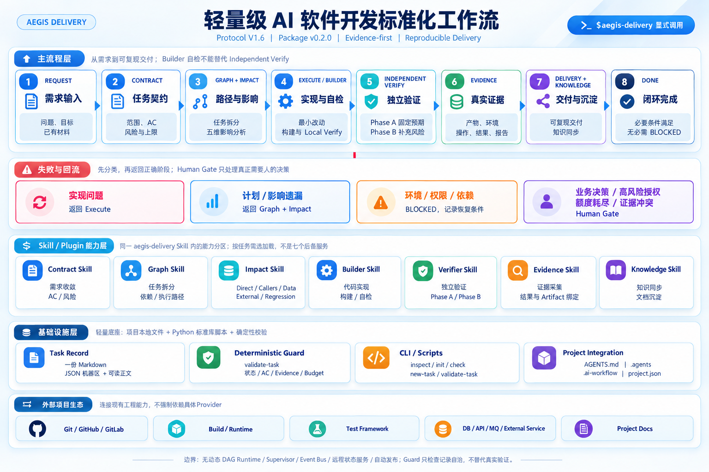
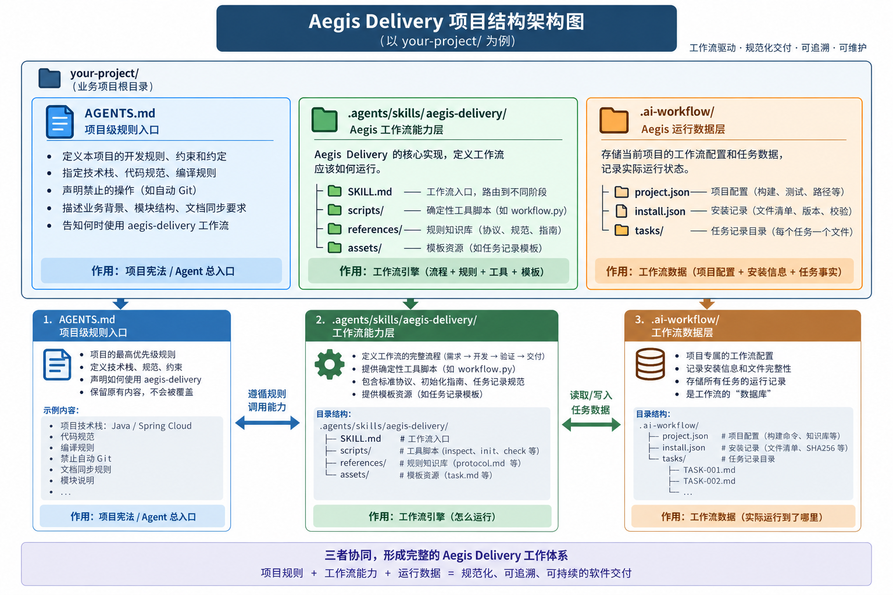

# Aegis Delivery

<p align="center">
  
</p>

[](https://github.com/longzhang2026-sudo/aegis-delivery/actions/workflows/ci.yml)
[](LICENSE)
[](skills/aegis-delivery/references/protocol.md)
[](CHANGELOG.md)
[English](README.en.md)

**把需求交给 Codex，通过任务契约、分阶段验证和可追溯 Evidence，帮助形成可复现的软件交付。**

Aegis Delivery 是《轻量级 AI 软件开发标准化工作流 V1.6》的开源实现，以项目内 Codex Skill 的形式接入业务项目。它把 Agent 开发从“完成了一段代码”推进到“范围明确、结论有证据、交付可复现且便于继续维护”。

项目采用 Python 标准库和项目本地文件，不要求固定 MCP、Git、Docker 或付费 API。它提供执行规则与确定性记录校验，不是无人值守编排服务，也不构成操作系统级权限隔离。

| 项目 | 当前状态 |
| --- | --- |
| 包版本 / 协议版本 | **v0.2.0** / **V1.6**（分别维护） |
| 运行条件 | Codex 或 Agent Skills 兼容工具；初始化脚本需要 Python 3.10+ |
| 适用范围 | 新项目的首个可运行纵向切片；存量项目的 Bug、功能切片与必要跨模块改动；本地或测试环境 |
| 成熟度 | **NOT_YET_PILOTED**：自动化工程检查已建立，真实业务试点尚未完成 |

## 60 秒试用

先在 Codex 中打开目标项目，然后发送这一条请求：

```text
$skill-installer
把 https://github.com/longzhang2026-sudo/aegis-delivery/tree/main/skills/aegis-delivery
直接安装到当前项目根目录的 .agents/skills。
安装后直接运行项目内 workflow.py，依次执行 inspect -> init -> check；
保留已有 AGENTS.md 规则，再识别实际 build/test/run 入口。
未执行的检查保持 NOT_VERIFIED。
```

只想先看效果，可直接阅读[虚构 Bug 示例](examples/bug-fix.md)；需要手动安装或迁移旧版，见[快速开始](#快速开始)。



主流程以 Contract 固定目标与验收，以 Graph + Impact 约束执行路径和影响面；Builder 负责实现与自检，Verifier 在独立上下文中分 Phase A / Phase B 验收。结论必须引用绑定当前产物、环境和输入的执行 Evidence；流程本身不能保证证据未被伪造。Task Record 保存任务事实，Deterministic Guard 在交付或恢复前检查记录自洽，但两者都不替代业务判断或实际验证。

## 解决什么问题

缺少显式交付约束时，Agent 开发容易出现四类缺口：需求边界在执行中漂移、自检被当作最终验收、测试结论没有对应产物与原始证据、交付后缺少复现和知识同步。本工作流用一条轻量主链降低这些风险：

- **Contract-first**：先固定目标、范围、兼容边界、AC、风险和上限。
- **Impact-aware**：检查 Direct / Callers / Data / External / Regression，不只修改表面入口。
- **Independent Verify**：Builder 不拥有标准路径最终 PASS 权限；Verifier 先固定预期，再读取实现。
- **Human-friendly verification**：真实环境只能由人操作时，用户只回复通过、失败或暂时无法验证；Skill 维护内部记录。
- **Evidence-first**：PASS 必须引用当前产物、环境、输入、操作、结果和原始报告位置。
- **Bounded Repair**：修复、Replan 和有效执行时间均有上限，必要时进入 Human Gate。
- **Reproducible Delivery**：交付清单覆盖 Artifact、Reproduce、Acceptance 和 Knowledge Sync。

首版不包含生产发布与运维，也不承诺效率提升、稳定性保证或客户成功结果。

## 核心流程

```text
Request
  -> Contract
  -> Graph + Impact
  -> Execute / Builder Self Check
  -> Independent Verify
  -> Human Verification Card（仅真实环境需要人工时）
  -> Evidence
  -> Delivery + Knowledge Sync
  -> DONE
```

Verify 未通过时先分类，再返回正确阶段：

| 问题类型 | 处理方式 |
| --- | --- |
| 实现问题 | 返回 Execute，额度内做最小修复并重新 Verify |
| 计划或影响遗漏 | 补查 Impact，必要时回到 Graph 并记录 Replan |
| 环境、权限或依赖不足 | 标记 BLOCKED，记录恢复条件和剩余额度 |
| 业务决策、高风险授权、额度耗尽或 Evidence 冲突 | 进入 Human Gate，只询问必要决策 |

同一根因最多自动修复 2 次，实质 Replan 最多 1 次；包默认任务总修复 4 次、有效执行时间 120 分钟，可在初始化或单任务 Contract 中调整。恢复、换模型或换上下文都不会清零累计值；脚本只校验记录，不自动计时或执行修复。

## 核心机制

### 一份 Task Record

每个任务只维护一份 `.ai-workflow/tasks/<TASK-ID>.md`：

- JSON 机器区保存状态、风险、额度、AC、Artifact 和 Evidence 引用。
- Markdown 正文保存 Contract、Graph、Impact、判断依据、交付与知识同步说明。
- AC 将 `type`、`applicability` 和 `verdict` 分开记录，避免把“不适用”与“未验证”混为一谈。

详细字段与 Required N/A 规则见 [Task Record schema v1](skills/aegis-delivery/references/task-record-schema.md)。

### 独立验证

- **Phase A**：独立上下文中的 Verifier 只读取 Contract / AC / Impact，先固定黑盒场景、输入、预期和断言。
- **Phase B**：再读取 Diff、实现与 Builder 自检，补充事务、缓存、并发、异常等实现特有风险。
- Builder 自检不能自动升级为 Independent PASS。没有独立上下文时必须保留 `NOT_VERIFIED` 或 `BLOCKED`。

只有同时满足 LOW 风险、不修改可执行逻辑/数据/配置/权限/API、不涉及金额/状态/跨模块且 Diff 可直接审查时，才能使用同上下文 Fast Verify。风险标签本身不构成例外依据。

### 真实环境需要人工验证

独立 Verifier 已固定预期并完成可执行检查，但剩余验收必须由用户进入测试环境操作时，Aegis Delivery 只展示一张业务语言验证卡：

```text
请验证：
1. 打开订单详情页。
2. 点击“查询物流”。
3. 预期：正常物流可展示；异常数据不会导致页面报错。

请回复：
A. 通过
B. 失败：实际现象……
C. 暂时无法验证：原因……
```

用户不需要编辑 Task Record、填写 Artifact/AC/Evidence 或运行 Guard。Skill 自动读取当前任务与产物，按 Contract 判断证据是否充分，把回复写回同一 Task Record，并在全部门禁满足后运行 `validate-task`、进入 DONE。

权限、金额、库存、迁移、不可逆副作用或 Contract 明确要求客观材料时，卡片会在操作前要求必要截图、响应、日志、前后状态或对账；裸“通过”不会自动升级 PASS。失败进入修复，无法验证保留 NOT_VERIFIED/BLOCKED 和恢复条件。完整规则见[使用手册](docs/usage.md#5-真实环境需要人工验证)。

### Deterministic Guard

交付或恢复前，Skill 会自动运行只读 Guard，检查 Task Record 的 schema、状态组合、额度和 Evidence 引用；用户不需要复制命令或判断内部字段。合法 DRAFT 缺口不会阻断，结构矛盾或 DONE 门槛不满足会停止闭环。

Guard 不会运行项目 build/test，成功只代表记录自洽，不代表业务行为已经正确。需要手工诊断记录的维护者可查阅[使用手册](docs/usage.md#7-验收后交付)。

## Skill / Plugin 能力

下列名称是同一个 `aegis-delivery` Skill 内的能力分区，不是七个独立 Skill、Agent 或后台服务：

| 能力分区 | 作用 |
| --- | --- |
| Contract Skill | 收敛目标、范围、AC、风险、上限和 Human Gate 条件 |
| Graph Skill | 将任务拆成“动作 -> 输出 -> 检查”，表达必要依赖与执行路径 |
| Impact Skill | 检查 Direct / Callers / Data / External / Regression |
| Builder Skill | 最小代码实现、构建、Local Verify 和交接材料 |
| Verifier Skill | 独立上下文验收，执行 Phase A / Phase B |
| Evidence Skill | 记录实际证据并绑定 AC 与当前 Artifact；当前不提供自动命令捕获服务 |
| Knowledge Skill | 把已验证、长期有效的事实同步到现有项目文档 |

仓库同时提供根目录 [`plugin.json`](plugin.json) 和 [`.codex-plugin/plugin.json`](.codex-plugin/plugin.json)。推荐方式仍是把 [`skills/aegis-delivery`](skills/aegis-delivery) 安装到目标项目；插件清单负责分发与兼容，不会自动获得外部工具权限。

## 快速开始

先确认两个不同位置：**本工作流仓库**和**要接入的业务项目**。不要把工作流源码仓库当作业务项目初始化。

| 当前情况 | 推荐入口 |
| --- | --- |
| 希望 Codex 完成检查、安装和项目基线验证 | 方式一 |
| 希望自己执行安装命令 | 方式二 |
| 目标项目已存在 `.agents/skills/aegis-delivery` | 跳到[安装后使用](#安装后使用)，无需重复安装 |

### 方式一：交给 Codex

把下面内容交给 Codex，并将占位符替换为真实路径：

```text
工作流仓库：<本仓库克隆或下载解压后的目录>
目标项目：<要接入工作流的业务项目目录>

请按工作流仓库中的 START.md 和初始化指南接入目标项目，
执行 inspect -> init -> check，再识别并验证业务项目必要的 build/test/run 入口；
保留当前项目的 AGENTS.md 和已有规则，不修改全局 Codex 配置。
输出初始化报告。尚未执行的检查保持 NOT_VERIFIED；
check 成功只能报告 CONFIGURED，基线实际通过后才能报告限定范围的 READY。
```

完整可复制指令见 [START.md](START.md)。需要已登录可用的 Codex、已存在且可写的目标项目，以及 Python 3.10+。首次安装只准备工作流，不会自动修改业务代码。

### 方式二：手动初始化

```bash
git clone https://github.com/longzhang2026-sudo/aegis-delivery.git
cd aegis-delivery
python skills/aegis-delivery/scripts/workflow.py inspect --project "/path/to/project"
python skills/aegis-delivery/scripts/workflow.py init --project "/path/to/project"
python skills/aegis-delivery/scripts/workflow.py check --project "/path/to/project"
```

以上命令在工作流仓库根目录运行，`/path/to/project` 必须替换为已存在的业务项目目录。Windows 可以使用 `python` 或 `py -3` 和 Windows 路径；macOS/Linux 按安装情况使用 `python3`。Skill 安装和目标项目本身不要求 GitHub 账号或 Git；若不使用 Git 获取本仓库，可下载 ZIP。

初始化会在目标项目中安装：

```text
your-project/
├── AGENTS.md
├── .agents/skills/aegis-delivery/
└── .ai-workflow/
    ├── project.json
    ├── install.json
    └── tasks/
```



`inspect` 只输出候选线索，不验证命令；`init` 安装项目内文件；`check` 成功只表示静态安装达到 `CONFIGURED`。项目必要运行入口实际通过并留存证据后，才能报告限定范围的 `READY`。安装、升级、卸载和冲突处理见 [初始化指南](skills/aegis-delivery/references/initialization.md)。

从旧 `$ai-delivery` 安装升级时，先按[旧名称迁移说明](skills/aegis-delivery/references/initialization.md#从旧名称迁移)处理，不要直接并存两个 Skill。

## 安装后使用

完成初始化后，在**目标项目**中调用 `$aegis-delivery`。新项目和存量项目使用同一流程，但起点不同。

### 新项目

从一个可运行、可验收的最小功能开始，不预建未来架构。

```text
$aegis-delivery
目标：创建一个订单查询服务。
要求：Python 3.12、仅使用标准库，先完成“输入订单号并返回订单信息”的可运行版本。
验收：按 README 可启动；正常查询和订单不存在场景都有自动检查。
```

### 存量项目

先复现问题和验证现有基线，再检查影响范围并做最小兼容修改。

```text
$aegis-delivery
目标：修复订单列表切换筛选后页码未重置的问题。
范围：只修改筛选与分页联动，保持接口和金额计算不变。
验收：切换或清空筛选后回到第一页；普通翻页保持正确。
```

### 独立验收

不需要默认手动新建任务。宿主支持独立 Agent 或隔离上下文时，由当前任务串行交接给 Verifier；不支持时，再在同一项目新建一个 Codex 任务：

```text
$aegis-delivery
独立验收 .ai-workflow/tasks/TASK-001.md。
先根据 Contract、AC、Impact 确定预期，再读取实现并执行必要检查。
不要修改业务代码，也不要把 Builder 自检当成最终 PASS。
```

Fast Verify、失败修复、恢复和交付规则见 [使用手册](docs/usage.md)。

## 文档导航

| 文档 | 用途 |
| --- | --- |
| [START.md](START.md) | 给安装者和 Codex 的统一入口 |
| [SKILL.md](skills/aegis-delivery/SKILL.md) | Skill 路由、Builder / Verifier 职责与全程约束 |
| [V1.6 协议](skills/aegis-delivery/references/protocol.md) | 主链、独立验证、Evidence、Loop、交付与 DONE 规则 |
| [初始化指南](skills/aegis-delivery/references/initialization.md) | inspect / init / check、项目基线、升级与故障恢复 |
| [Task Record schema](skills/aegis-delivery/references/task-record-schema.md) | 机器区、AC 合法组合、Evidence 与 Guard 错误规则 |
| [使用手册](docs/usage.md) | 从需求到验收、恢复和交付的完整步骤 |
| [任务模板](skills/aegis-delivery/assets/task.md) | 一份记录承载契约、证据、交付与知识同步 |
| [示例](examples/bug-fix.md) | 虚构 Bug，展示真实填写方式，不伪造通过结果 |
| [验证方法](docs/testing.md) | 脚本回归、Agent 行为场景和真实试点边界 |
| [设计来源](docs/design.md) | V1.6 原文映射、专业 Skill 参考和简化原则 |

## 边界与限制

- 当前版本覆盖开发与本地/测试环境交付，不包含生产发布和运维。
- Guard 不能证明业务语义正确、Evidence 未伪造、Verifier 绝对独立或历史未被修改。
- 当前没有自动 Evidence Capture、完整 dirty-worktree Artifact 快照或防篡改账本。
- 不包含动态 DAG Runtime、Agent Supervisor、Event Bus、远程状态服务、复杂 Memory 或自动发布系统。
- MCP、CodeGraph、数据库工具、浏览器和 CI 都是可替换 Provider；缺少某个插件不等于流程必须停止。
- 项目仍标记 `NOT_YET_PILOTED`：工程检查已经通过，真实业务交付稳定性仍需用 Bug、功能切片和跨模块任务验证。

## 测试与贡献

```bash
python -m unittest discover -s tests -v
```

自动测试覆盖安装器、项目配置、Task Guard、有限项目扫描与本地文档链接；CI 配置在 Windows、Linux、macOS 的 Python 3.10 / 3.13 环境运行同一套检查。单元测试或 CI 通过不等于真实客户项目已经完成 V1.6 试点。

欢迎提交问题和最小修复。开始前请阅读 [贡献指南](CONTRIBUTING.md)、[变更记录](CHANGELOG.md) 与 [MIT 许可证](LICENSE)。本仓库只参考成熟 Skill 的组织方式，不复制受其他许可约束的实现。
