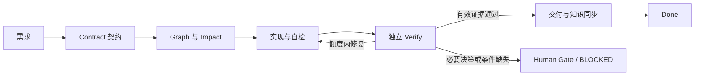

# AI Delivery Workflow

[](https://github.com/longzhang2026-sudo/ai-delivery-workflow/actions/workflows/ci.yml)
[](LICENSE)
[English](README.en.md)

**把需求交给 Codex，通过任务契约、独立验证和真实证据，得到可复现的软件交付。**

这是 Long 的《轻量级 AI 软件开发标准化工作流 V1.6》的开源 Skill 实现。包版本 **0.2.0**，流程协议仍为 **1.6**。中文优先、项目内安装、Python 标准库实现、没有必需的 MCP 或付费 API。



## 适合什么任务

- 可复现 Bug、普通功能的一个纵向切片、必要跨模块改动。
- 希望每次交付都有明确范围、验收依据和可继续的任务记录。
- 已有工程和构建入口，希望快速接入，不更换技术栈。

标准路径由 Builder 实现、独立上下文的 Verifier 验收。严格符合白名单的 LOW 风险文档类改动可简化。首版覆盖开发与本地/测试环境交付，不包含生产运维。

**能力边界：** 本包提供 Skill 指导、确定性初始化和任务记录 Guard，不是无人值守平台。Guard 只检查记录结构和状态自洽，不会判断业务结果真实、证明独立验证发生或提供防篡改历史；项目真实行为必须运行验证，生产操作需要单独授权。

## 最快开始：把这段交给 Codex

```text
请把 https://github.com/longzhang2026-sudo/ai-delivery-workflow
中的 AI Delivery Skill 安装到当前项目。
先下载/读取仓库的 START.md，按它检查、初始化、执行静态校验，
再识别并验证当前项目必要的运行入口，输出初始化报告。
保留现有项目规则，只修改项目内文件，不修改全局 Codex 配置。
默认任务总修复 4 次、有效执行时间 120 分钟；已有明确约定优先。
尚未执行的检查必须保留 NOT_VERIFIED；完成后给我首次任务的用法。
```

需要已登录可用的 Codex 和可写项目。脚本需要 Python 3.10+，无第三方 Python 依赖。**首次安装只准备工作流，不自动选择业务需求或修改业务代码。** 完整步骤见 [START.md](START.md)。

也可以下载 GitHub 的 **Code → Download ZIP**，解压后把本地目录及目标项目目录交给 Codex。这样目标项目不需要 GitHub 账号或 Git。

## 手动初始化

先克隆仓库，然后在仓库根目录执行：

```bash
git clone https://github.com/longzhang2026-sudo/ai-delivery-workflow.git
cd ai-delivery-workflow
python skills/ai-delivery/scripts/workflow.py inspect --project "/path/to/project"
python skills/ai-delivery/scripts/workflow.py init --project "/path/to/project"
python skills/ai-delivery/scripts/workflow.py check --project "/path/to/project"
```

macOS/Linux 按安装情况使用 `python3`；Windows 用 `python` 或 `py -3`，路径可替换为 `D:\work\your-project`。目标目录必须已存在。具体文件、状态、限额覆盖、升级与故障恢复见 [详细初始化指南](skills/ai-delivery/references/initialization.md)。

`init` 安装 `.agents/skills/ai-delivery`，追加 AGENTS.md 入口，并生成 `.ai-workflow/project.json`。重复执行不覆盖已有配置。`check` 成功只表示 **CONFIGURED**；项目基线和真实交付需另外验证。

## 安装后怎么用

在 Codex 打开目标项目，显式调用 Skill：

```text
$ai-delivery
修复：订单列表切换筛选后页码没有重置。
范围：只修复筛选与分页联动，保持接口和金额计算不变。
验收：筛选改变时回到第一页；清空筛选恢复默认列表；普通翻页仍正确。
请先整理任务契约，再实现、自检，并准备独立验证交接。
```

需要人工独立交接时，新建另一个 Codex 任务打开同一项目：

```text
$ai-delivery
你负责独立验收任务 .ai-workflow/tasks/TASK-001.md。
Phase A 先只读 Contract、AC、Impact，固定黑盒场景与预期；
然后 Phase B 再读实现 Diff 和交接材料，实际执行必要验证。
不要修改业务代码；按当前产物记录真实 Evidence，不把自检当最终 PASS。
```

完整任务、验收、恢复、交付提示词见 [使用手册](docs/usage.md)。

新任务会在同一份 Markdown 中保存可见的 JSON 机器区和可读正文。交付或恢复前运行只读 Guard：

```bash
python .agents/skills/ai-delivery/scripts/workflow.py validate-task --project . --id TASK-001
```

合法 DRAFT 缺口产生 WARN 并返回 0；结构矛盾或 DONE 门槛不满足返回 ERROR 和退出码 2。v0.1 旧任务不会被自动改写，迁移方法见 [Task Record schema](skills/ai-delivery/references/task-record-schema.md#旧任务)。

## 仓库内容

| 入口 | 用途 |
| --- | --- |
| [START.md](START.md) | 给安装者和 Codex 的统一入口 |
| [SKILL.md](skills/ai-delivery/SKILL.md) | 可独立安装的 Skill 与意图路由 |
| [协议](skills/ai-delivery/references/protocol.md) | V1.6 核心规则和明确的实现约定 |
| [Task Record schema](skills/ai-delivery/references/task-record-schema.md) | 机器区、AC 合法组合、Evidence 与 Guard 错误规则 |
| [初始化指南](skills/ai-delivery/references/initialization.md) | 安装、项目基线、状态、恢复和升级 |
| [使用手册](docs/usage.md) | 从一个需求到验收与交付的完整步骤 |
| [任务模板](skills/ai-delivery/assets/task.md) | 一份记录承载契约、证据、交付与同步 |
| [示例](examples/bug-fix.md) | 虚构场景，展示如何填写，不伪造通过结果 |
| [验证方法](docs/testing.md) | 脚本回归、Agent 行为场景与真实试点边界 |
| [设计来源](docs/design.md) | 原文映射、参考项目、简化与限制 |
| [plugin.json](plugin.json) | portable Agent Plugin 根清单 |
| [.codex-plugin/plugin.json](.codex-plugin/plugin.json) | Codex 界面兼容清单 |

项目内 Skill 安装是推荐入口。插件清单不表示本项目已进入官方市场，也不会自动获得外部工具权限；当前 Codex 的插件分发方式见 [官方文档](https://developers.openai.com/plugins/build/plugins)。

## 测试与贡献

```bash
python -m unittest discover -s tests -v
```

测试检查安装器、配置、Task Guard、有限扫描与文档结构，不代表真实客户项目已经通过 V1.6 试点。CI 状态以页面实际运行结果为准。当前仍需要真实 Bug、功能切片、跨模块任务试点，参见 [验证方法](docs/testing.md)。

欢迎提交问题和最小修复，见 [贡献指南](CONTRIBUTING.md)、[变更记录](CHANGELOG.md) 与 [MIT 许可证](LICENSE)。本仓库自行实现，参考成熟 Skill 的组织方式，不复制其受不同许可约束的内容。
